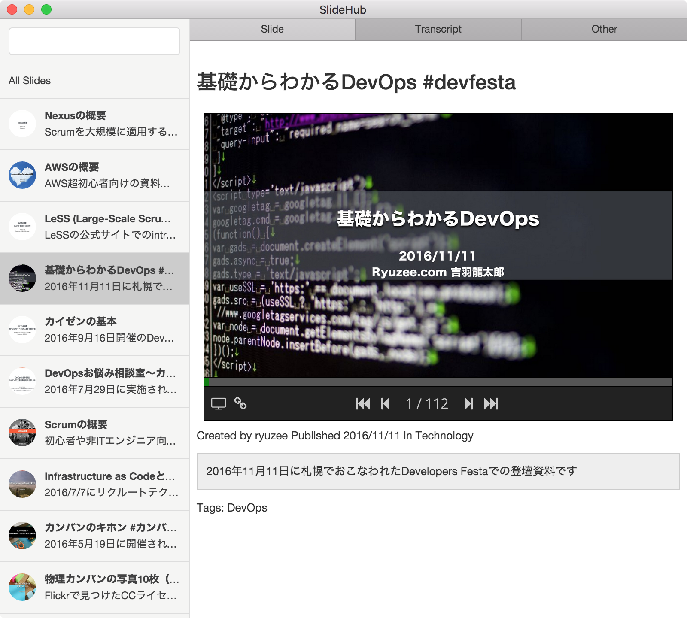

# SlideHubClient

SlideHubClient is html-based client for [SlideHub](https://github.com/ryuzee/SlideHub). It also can be used as Electron application.



## How to build

```
npm install
npm install electron-prebuilt@0.35.1 -g
npm install bower -g
bower install
npm install grunt -g
grunt shell:build_mac
```

